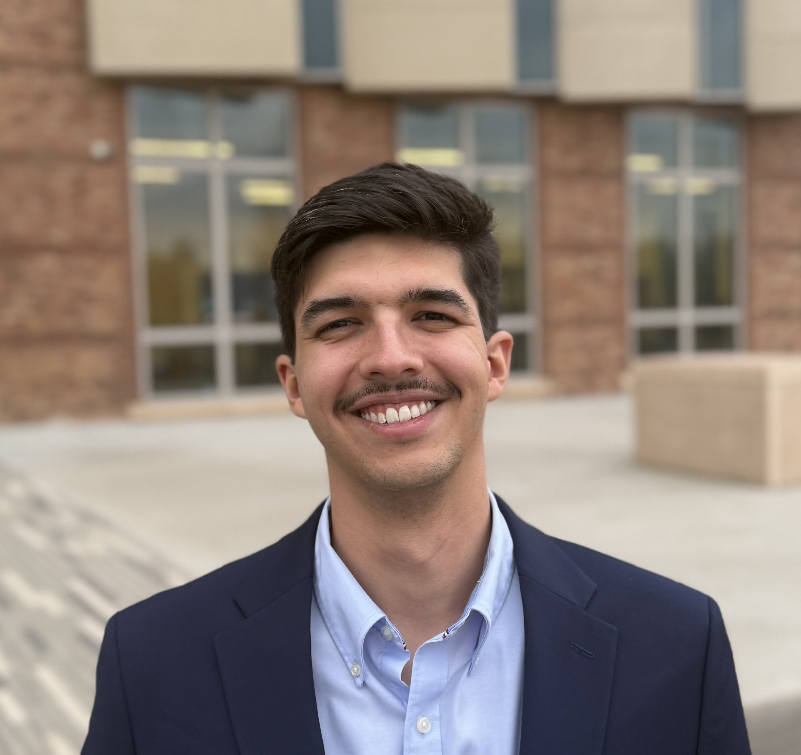
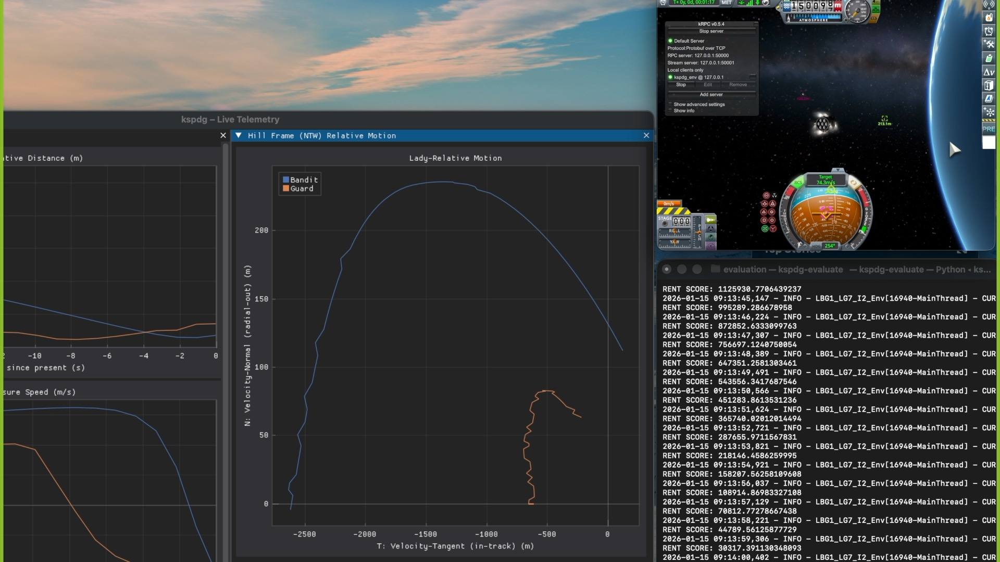

:::: {.columns .v-center style="margin-top: 1.5rem; margin-bottom: 2rem;"}

::: {.column width="30%"}
{width=85% .rounded}
:::

::: {.column width="70%"}

# Lorenzzo Mantovani

### Reinforcement learning for autonomous spacecraft decision-making

I leverage deep reinforcement learning and planning methods to enable autonomous decision-making in complex and uncertain environments.

My research lies at the intersection of aerospace engineering and machine learning, with the goal of enabling reliable autonomy in safety-critical systems such as spacecraft and multi-agent space missions.

[GitHub](https://github.com/lorenzzoqm) ·
[LinkedIn](https://www.linkedin.com/in/lorenzzo-mantovani/) ·
[Google Scholar](https://scholar.google.com/citations?user=e1Qpc9gAAAAJ&hl=pt-BR) ·

:::

::::

## Research Focus

- **Autonomous Earth-observing spacecraft:** reinforcement learning for real-time satellite tasking under uncertainty, including cloud coverage and long-horizon decision-making.

- **Safe and robust learning-based control:** integrating safety mechanisms such as shielding and training strategies like curriculum learning to ensure reliable operation of autonomous spacecraft.

- **Distributed and adversarial autonomy:** multi-agent coordination for satellite constellations and reinforcement learning approaches for adversarial agent scenarios.

## Featured Highlight

:::: {.columns .g-4 .v-center .featured-columns}

::: {.column width="35%"}
{width=100%}
:::

::: {.column width="65%"}

### Capture the Satellite Challenge — AIAA SciTech (2026)

Our CU Boulder team placed **Second Place** in the Capture the Satellite Challenge, developing autonomous spacecraft control strategies for an on-orbit interception scenario.

[CU Boulder article](https://www.colorado.edu/aerospace/cu-boulder-team-earns-second-capture-satellite-challenge) ·
[Aerospace America coverage](https://aerospaceamerica.aiaa.org/institute/gotcha-students-capture-malfunctioning-satellite-in-spacecraft-control-exercise/)

:::

::::

## Selected Projects

:::: {.columns .g-4}

::: {.column width="33%"}
### Earth-Observing Satellites

Reinforcement learning for agile Earth-observing spacecraft, including shielding, curriculum learning, and cloud coverage uncertainty.

[View project details →](research.qmd)
:::

::: {.column width="33%"}
### Multi-Agent Systems

Distributed and intent-sharing approaches for autonomous satellite constellations and large-scale coordination.

[View project details →](research.qmd)
:::

::: {.column width="33%"}
### Adversarial Autonomy

Decision-making in adversarial spacecraft pursuit-evasion scenarios.

[View project details →](research.qmd)
:::

::::

## Selected Links

- [Publications](publications.qmd)
- [Talks & Media](talks-media.qmd)
- [Blog](blog/index.qmd)
